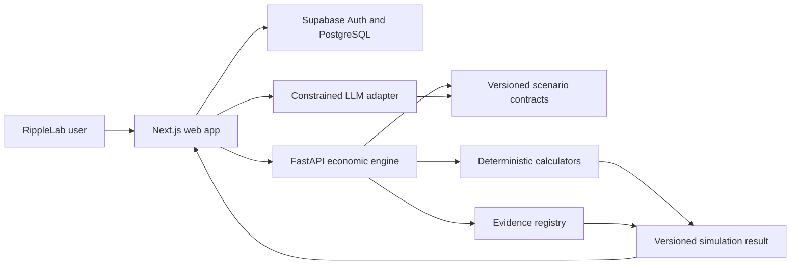

# RippleLab Architecture

## System context

## Repository boundaries

### `apps/web`

Owns rendering, navigation, profile/scenario forms, visualization and server-side orchestration. It does not calculate authoritative monetary effects.

### `services/economic-engine`

Owns validation, formulas, simulations, rounding, causal result assembly and formula versions. It accepts structured data and returns structured results.

### `packages/contracts`

Owns canonical JSON Schema plus language-facing types. Contract changes must be backward-aware and tested before web or engine changes merge.

### `data/sources`

Will hold versioned metadata and allowed snapshots from primary evidence sources. Runtime outputs will refer to source identifiers rather than free-form citations.

## Data flow

1. The user supplies profile data and a question/template.
2. A constrained parser proposes structured scenario JSON.
3. The user confirms extracted values and units.
4. The API validates the request against versioned contracts.
5. Deterministic calculators produce component impacts.
6. Simulation code optionally evaluates documented uncertain assumptions.
7. The API assembles results, causal nodes/edges, evidence identifiers and confidence.
8. The UI renders the result; an LLM may explain only values already present in the result envelope.

## Day 1 runtime contract

- Web health surface: `GET /` at `http://localhost:3000`
- API root: `GET /`
- API liveness: `GET /health`
- API version: `0.1.0`
- Initial shared schema: `packages/contracts/schemas/health-response.schema.json`

## Planned deployment

- Web: Vercel
- API: Render or Railway
- Authentication/database: Supabase

Production provisioning is deliberately deferred; no cloud credentials are required for the Day 1 foundation.
